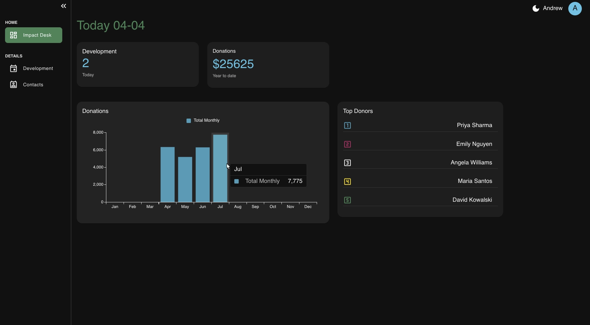

# Impact Desk

A fundraising activity planner for nonprofit fundraising managers and development staff who need to organize in-person donor meetings, visits, and events more efficiently.

The app is built around in-person donor relationship work and daily fundraising coordination. Users can schedule relationship-building activities, filter them by day, and view addresses on an interactive map for better route planning.




## Tech Stack

- **Frontend:** React 19 w/ JavaScript, Material UI, React Leaflet
- **Backend:** Django, Django REST Framework (DRF)
- **Database:** PostgreSQL
- **Data / Utilities:** SWR, Axios, Day.js
- **3rd Party API:** Google Geocoding API via `react-geocode`
- **Webserver:** Nginx
- **Infrastructure:** Docker

## Getting Started

### Dependencies 

- Docker
- Docker Compose

### Local Setup

1. Clone the repository.
2. From the project root, start the application:
   ```
   ./run-compose-dev.sh
   ```
3. The script builds containers, starts the frontend, backend, and database, completes Django migrations, and loads the starter fixture data.
4. The frontend is at [http://localhost:5173/](http://localhost:5173/)
5. The Django API is at [http://localhost:8000/](http://localhost:8000/)

### Optional Environment Variables

Create a `frontend/.env` file if you want address geocoding and map marker generation to work with real user-entered addresses:
```
VITE_GEOCODE_KEY=<your-google-geocode-api-key>
```

## Features

- **User Authentication** -- Signup, login with DRF token, and logout. Dashboard routes and API endpoints are protected.
- **Development Scheduling** -- Create and filter by day.
- **Interactive Map** -- Addresses are geocoded and displayed on the map.
- **Contact Management** -- Create people and organizations with full address and contact details.
- **Donation Tracking** -- View monthly donation bar chart and top donor summary.
- **Dashboard Overview** -- At-a-glance cards, schedule count, total donations, a donation chart, and a top donors list.

## Demo Flow

1. Signup and login to access dashboard.
2. Use form to add to schedule with a date, time, contact, and address.
3. Choose developments by day to focus on that day's schedule.
4. Look at the map to see locations to plan in-person visits more efficiently.
5. Review dashboard summaries of today's number of developments, donation totals, charts, and top donors.

## Data Model


| Model             | Key Fields                                                         | Relationships                                     |
| ----------------- | ------------------------------------------------------------------ | ------------------------------------------------- |
| **People**        | first_name, last_name, phone, email, address fields                | Has many Donations, has many Developments         |
| **Organizations** | title, website, phone, email, address fields                       | Has many Donations, has many Developments         |
| **Donations**     | donations (amount), donate_type, date                              | ForeignKey to People, ForeignKey to Organizations |
| **Developments**  | type, date, time, end_time, status, note, address fields, lat, lng | ForeignKey to People, ForeignKey to Organizations |


## API Endpoints


| Endpoint                  | Methods          | Description                                            |
| ------------------------- | ---------------- | ------------------------------------------------------ |
| `/auth/signup`            | POST             | Create a new user account                              |
| `/auth/get-token`         | POST             | Obtain auth token with credentials                     |
| `/auth/users`             | GET              | Get authenticated user profile                         |
| `/api/people/`            | GET, POST        | List or create contacts                                |
| `/api/people/<id>`        | GET, PUT, DELETE | Retrieve, update, or delete a contact                  |
| `/api/organizations/`     | GET, POST        | List or create organizations                           |
| `/api/organizations/<id>` | GET, PUT, DELETE | Retrieve, update, or delete an organization            |
| `/api/donations/`         | GET, POST        | List or create donations                               |
| `/api/donations/<id>`     | GET, PUT, DELETE | Retrieve, update, or delete a donation                 |
| `/api/developments/`      | GET, POST        | List or create developments (supports `?date=` filter) |
| `/api/developments/<id>`  | GET, PUT, DELETE | Retrieve, update, or delete a development              |

